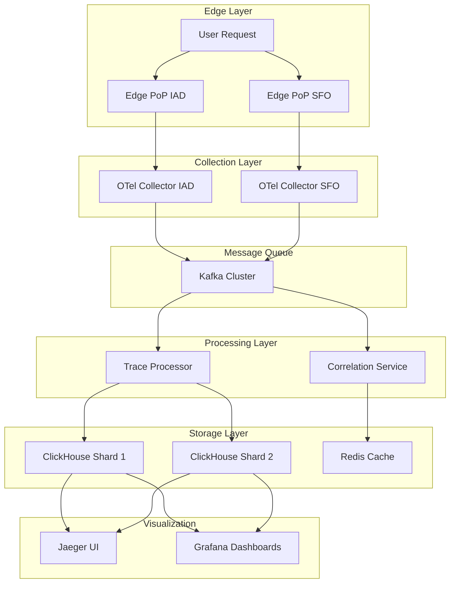

# Building Enterprise-Grade Distributed Tracing for Vercel: A Complete Observability Journey

_Published on 2025-06-25 | 15 min read_

## Introduction

In today's distributed, serverless world, observability is very important. When your application spans multiple regions, edge locations, microservices and serverless functions, traditional monitoring approaches fall short. This tutorial takes you through building a distributed tracing system specifically designed for learning and experimentation with a global architecture in mind.


## The Challenge: Observability at Global Scale

Modern applications face unprecedented observability challenges that traditional monitoring tools simply cannot address. As applications become more distributed, spanning multiple regions and leveraging edge computing, the complexity of understanding system behavior grows exponentially.

The first major challenge is cross-region trace correlation. When a user request flows through multiple geographic regions—perhaps starting at an edge location in Frankfurt, processing in a serverless function in Madrid, and completing in a database in Oregon, the trace becomes fragmented across different systems. Traditional tracing solutions often fail to stitch these fragments together, leaving engineers with incomplete pictures of request flows.

Edge function latency impact represents another critical concern. In a world where every millisecond matters, the overhead introduced by tracing instrumentation can directly impact user experience. Edge functions, which are designed for ultra-low latency, cannot afford the traditional tracing overhead that might add tens or hundreds of milliseconds to response times.

Intelligent sampling at scale becomes essential as applications grow. Collecting traces for every single request quickly becomes cost-prohibitive, both in terms of storage costs and processing overhead. However, naive sampling approaches can break trace completeness, making it impossible to debug issues that span multiple services.

Finally, horizontal storage scaling presents a challenge. Single storage instances simply cannot handle the volume of data generated by high-traffic applications. When you're dealing with billions of spans per day, you need a storage solution that can distribute load across multiple instances while maintaining query performance.

## Architecture Overview



## Technology Stack Deep Dive

**OpenTelemetry** serves as our collection layer, providing a vendor-neutral, industry-standard approach to instrumenting applications. This choice ensures compatibility across different programming languages and frameworks while providing the low latency required for edge function instrumentation. The OpenTelemetry ecosystem has matured significantly, offering robust collectors that can handle high-throughput scenarios without introducing significant overhead.

**Apache Kafka** forms the backbone of our message queue layer, providing the buffering and regional isolation capabilities essential for a global observability system. Kafka's distributed nature allows us to handle traffic spikes gracefully, while its topic-based architecture enables regional isolation. Each geographic region maintains its own topic, ensuring that regional issues don't cascade across the entire system.

For processing, we choose **Node.js** with custom logic rather than off-the-shelf solutions. This decision allows us to implement sophisticated sampling algorithms and cross-region correlation logic. Node.js's event-driven architecture and excellent JSON processing capabilities make it ideal for the high-throughput, low-latency requirements of trace processing.

**ClickHouse** serves as our storage layer, chosen for its performance characteristics for time-series data. The columnar storage format provides excellent compression ratios, often achieving 80% or better compression for observability data. ClickHouse's SQL compatibility makes it accessible to engineers familiar with traditional databases, while its horizontal scaling capabilities allow us to distribute data across multiple instances.

**Redis** provides the correlation layer, offering sub-millisecond latency for cross-region trace stitching operations. When traces span multiple regions, Redis stores the correlation information needed to stitch them together. The persistence capabilities ensure that correlation data survives service restarts, while the in-memory nature provides the performance required for real-time operations.

For visualization, we leverage Jaeger and Grafana, two industry-standard tools that provide complementary capabilities. **Jaeger** excels at trace exploration and debugging, offering intuitive interfaces for understanding request flows and identifying bottlenecks. **Grafana** provides the monitoring and alerting capabilities needed for operational oversight, with dashboards that can track system health and performance metrics.

## Step 1: Setting Up the Infrastructure

### Prerequisites

Docker and Docker Compose form our containerized architecture, allowing us to run the entire observability stack locally. The system requires at least 4GB of available RAM to handle the various services, including Kafka, ClickHouse, and the processing components.

The system uses several ports for different services: 3000-3002 for Grafana and application services, 8123 for ClickHouse's HTTP interface, 9092 for Kafka, and 16686 for Jaeger's web interface. Ensure these ports are available to prevent conflicts during startup.

### Project Structure

The project follows a logical structure that separates concerns and makes the system easy to understand and maintain. The root directory contains the core configuration files, including the Docker Compose file that orchestrates all services and the collector template that provides unified configuration for OpenTelemetry collectors.

The trace processor represents the heart of the system, implementing the sophisticated sampling and correlation logic that makes the observability system intelligent rather than simply collecting data. The application simulator generates realistic traffic patterns that help validate the system's performance characteristics.

Supporting directories include ClickHouse initialization scripts that set up the database schema and Grafana configuration that provides pre-built dashboards and data source configurations. This structure ensures that anyone can quickly understand the system's components and their relationships.

## Step 2: Understanding the Collection Layer

### OpenTelemetry Collector Configuration

The OpenTelemetry collector receives spans from instrumented applications and performs initial processing. Our configuration focuses on three key areas:

**Low Latency**: Edge functions cannot tolerate significant overhead. We use batch processing to minimize per-span overhead while maintaining reasonable delivery times.

**Intelligent Sampling**: We implement function-type-specific sampling rather than uniform rates. Error traces and slow requests get 100% sampling, while static assets get minimal sampling.

**Regional Context**: All spans are automatically enriched with geographic information using environment variables, making deployment across regions straightforward.

```yaml
# collector-template.yml
receivers:
  otlp:
    protocols:
      grpc:
        endpoint: 0.0.0.0:4317
      http:
        endpoint: 0.0.0.0:4318

processors:
  # Add region-specific attributes
  attributes:
    actions:
      - key: platform.region
        value: ${env:REGION}
        action: insert
      - key: platform.pop_type
        value: edge
        action: insert

  # Intelligent sampling
  tail_sampling:
    decision_wait: 10s
    num_traces: 50000
    expected_new_traces_per_sec: 100
    policies:
      # Always sample errors
      - name: errors
        type: status_code
        status_code:
          status_codes: [ERROR]

      # Always sample slow requests
      - name: slow_requests
        type: latency
        latency:
          threshold_ms: 5000

      # Sample edge functions at 5%
      - name: edge_functions
        type: and
        and:
          and_sub_policy:
            - name: edge_function_check
              type: string_attribute
              string_attribute:
                key: function.type
                values: ["edge"]
            - name: edge_sample_rate
              type: probabilistic
              probabilistic:
                sampling_percentage: 5
```

### Key Configuration Insights

- **Environment Variables**: Each collector gets its region identifier via environment variables
- **Tail Sampling**: Makes decisions after seeing complete traces, ensuring trace completeness
- **Batch Processing**: Groups spans together to optimize throughput
- **Multiple Exporters**: Sends traces to Kafka, Jaeger, and logging systems for redundancy

## Step 3: Message Queue Architecture

### Why Kafka?

The choice of Apache Kafka as our message queue layer addresses the unique challenges of distributed tracing at scale. Kafka provides several critical benefits:

**Buffering**: Traffic patterns in web applications are inherently bursty. Kafka's persistent message storage handles traffic spikes gracefully, ensuring no traces are lost during high load periods.

**Regional Isolation**: Each geographic region maintains its own topic, preventing issues in one region from cascading across the entire system. This isolation is crucial for system stability.

**Fault Tolerance**: Kafka's distributed architecture replicates data across multiple brokers, providing redundancy that protects against data loss. The system continues operating even if individual brokers fail.

**Scalability**: Kafka can handle millions of messages per second, making it suitable for high-traffic applications. The system scales horizontally by adding more brokers as applications grow.

### Topic Structure

The topic structure reflects our geographic distribution, with each region maintaining its own topic:

- Washington DC: `traces-iad1`
- San Francisco: `traces-sfo1`

This naming convention makes data flow easy to understand and troubleshoot. Each topic receives traces exclusively from its respective region, enabling parallel processing while maintaining the ability to correlate traces that span multiple regions through the correlation service.

## Step 4: Trace Processing Engine

### The Heart of the System

The trace processing engine represents the most sophisticated component of an observability system, implementing several advanced features that transform raw trace data into actionable insights. This component serves as the bridge between the collection layer and the storage layer, applying intelligent processing that maximizes the value of collected data.

Trace-complete sampling ensures that we never break the integrity of traces while still achieving significant cost savings. The algorithm makes sampling decisions based on the entire trace rather than individual spans, ensuring that if we sample any part of a trace, we sample the entire trace. This approach maintains the ability to debug issues that span multiple services while reducing storage and processing costs.

Cross-region correlation addresses one of the most challenging aspects of distributed tracing in a global environment. When traces span multiple regions, the processing engine uses Redis to store correlation information and stitches traces together. This capability is essential for understanding the complete request flow in a globally distributed application.

Intelligent storage optimization ensures that data is stored in a format that maximizes query performance while minimizing storage costs. The processor transforms raw trace data into a structured format optimized for ClickHouse's columnar storage, including pre-computed fields that accelerate common queries.

Performance monitoring provides real-time visibility into the processing engine's health and performance. The processor tracks metrics such as throughput, error rates, and processing latency, enabling proactive monitoring and alerting.

### Core Processing Logic

The processing engine is implemented as a Node.js application that consumes messages from Kafka topics and processes them according to sophisticated business logic. The engine uses a class-based architecture that encapsulates the processing logic and provides clear separation of concerns.

The constructor initializes connections to Kafka and ClickHouse, configures sampling rates for different types of traces, and sets up the consumer that will process incoming messages. The Kafka connection uses optimized settings for high-throughput scenarios, including retry logic that handles temporary network issues gracefully.

The ClickHouse connection includes compression settings that reduce network overhead while maintaining query performance. The connection pool is configured to handle the concurrent queries generated by the processing engine, ensuring that storage operations don't become a bottleneck.

Sampling rates are configured based on the characteristics of different types of traces. Error traces and slow requests receive 100% sampling to ensure we never miss critical issues, while static asset requests receive minimal sampling to reduce noise and cost. API calls and serverless functions receive intermediate sampling rates that balance visibility with cost.

```javascript
class DistributedTraceProcessor {
  constructor() {
    // Kafka setup with optimized configuration
    this.kafka = new Kafka({
      clientId: "trace-processor",
      brokers: [process.env.KAFKA_BROKER || "localhost:9092"],
      retry: { initialRetryTime: 100, retries: 8 },
    });

    // ClickHouse client with compression
    this.clickhouse = createClient({
      host: `http://${process.env.CLICKHOUSE_HOST || "localhost"}:${
        process.env.CLICKHOUSE_PORT || "8123"
      }`,
      username: process.env.CLICKHOUSE_USER || "admin",
      password: process.env.CLICKHOUSE_PASSWORD || "password",
      database: "traces",
      compression: { response: true, request: true },
    });

    // Trace-complete sampling configuration
    this.samplingRates = {
      error_traces: 1.0, // Sample all errors
      slow_traces: 1.0, // Sample all slow requests (>5s)
      api_traces: 0.1, // 10% of API calls
      static_traces: 0.001, // 0.1% of static assets
      edge_traces: 0.05, // 5% of edge functions
      serverless_traces: 0.2, // 20% of serverless functions
    };
  }
}
```

### Intelligent Sampling Algorithm

The sampling algorithm represents one of the most important aspects of our observability system. Rather than applying simple probabilistic sampling, the algorithm should considers multiple factors to make intelligent decisions about which traces to retain.

The algorithm should sample error traces and slow requests, ensuring that we never miss critical issues that require investigation. Error traces provide insight into system failures and user experience issues, while slow requests help identify performance bottlenecks that affect user experience.

The algorithm should use deterministic sampling based on trace IDs to ensure consistent behavior. This approach ensures that if a trace is sampled in one region, it will be sampled in all regions, maintaining trace completeness for distributed requests.

```javascript
shouldSampleSpan(span) {
  const isError = span.status?.code === 2;
  const isSlow = span.endTimeUnixNano - span.startTimeUnixNano > 5000000000; // >5s
  const functionType = span.attributes?.["function_type"];
  if (isError || isSlow) return true;
  const rate = this.samplingRates[`${functionType}_traces`] || 0.1;
  const hash = crypto.createHash("md5").update(span.traceId).digest("hex");
  const sample = parseInt(hash.slice(0, 8), 16) / 0xffffffff;
  return sample < rate;
}
```

### Cross-Region Correlation

Cross-region correlation represents one of the most challenging aspects of distributed tracing in a global environment. When traces span multiple regions, the processing engine must stitch them together to provide a complete picture of the request flow.

The correlation process uses Redis to store information about which regions have contributed to each trace. When a span arrives from a region, the processor stores the region information in Redis using the trace ID as the key. The processor then checks if spans from multiple regions exist for the same trace.

If multiple regions are involved, the processor triggers a correlation process that combines the trace fragments into a unified trace. This process ensures that engineers can see the complete request flow, even when it spans multiple geographic locations.

The correlation process is designed to be fault-tolerant, handling cases where Redis is temporarily unavailable or where correlation data is incomplete. The system continues to process traces even when correlation fails, ensuring that observability coverage is maintained.

```javascript
// Cross-region correlation logic (conceptual)
async correlateCrossRegionTrace(traceId, regions) {
  // Store region information in Redis
  await redis.sadd(`trace:${traceId}:regions`, region);

  // Check if we have spans from multiple regions
  const regions = await redis.smembers(`trace:${traceId}:regions`);

  if (regions.length > 1) {
    // Stitch the trace together
    await stitchCrossRegionTrace(traceId, regions);
  }
}
```

## Step 5: Storage Layer with ClickHouse

### Why ClickHouse?

The choice of ClickHouse as our storage layer reflects careful consideration of the specific requirements of observability workloads. ClickHouse provides several characteristics that make it ideal for storing and querying trace data at scale.

Columnar storage represents one of ClickHouse's most valuable features for observability data. Unlike traditional row-based storage, columnar storage stores data by column rather than by row. This approach provides excellent compression ratios, often achieving 80% or better compression for observability data. The compression reduces storage costs and improves query performance by reducing the amount of data that must be read from disk.

High performance makes ClickHouse suitable for interactive queries on large datasets. The database can execute complex queries on billions of rows in sub-second timeframes, making it possible to investigate issues in real-time. This performance is essential for debugging production issues where engineers need immediate access to trace data.

Horizontal scaling allows the system to grow with application traffic. ClickHouse can distribute data across multiple instances using sharding, providing a clear path for scaling as data volumes increase. The sharding strategy ensures that related data is stored together, maintaining query performance while distributing load.

SQL compatibility makes ClickHouse accessible to engineers familiar with traditional databases. The familiar query language reduces the learning curve and enables engineers to leverage existing SQL knowledge for trace analysis. This compatibility also enables integration with existing tools and workflows.

### Schema Design

The ClickHouse schema should be designed to optimize both storage efficiency and query performance for observability workloads.
**Example:**
The schema should include all the essential fields needed for trace analysis while using data types that maximize compression and query performance.

The timestamp field uses ClickHouse's DateTime64 type with millisecond precision, providing the temporal context needed for trace analysis. The trace_id and span_id fields use the String type, which provides good compression for UUID-like values while maintaining query performance.

Duration fields use UInt64 to store nanosecond-precision timing information, enabling detailed performance analysis. Status codes and flags use UInt8 to minimize storage while providing sufficient range for the values they need to represent.

The schema includes pre-computed fields such as is_slow and is_error that accelerate common queries. These fields are computed during the processing phase, eliminating the need for complex calculations during query time.

```sql
CREATE TABLE IF NOT EXISTS spans (
    timestamp DateTime64(9),
    trace_id String,
    span_id String,
    parent_span_id String,
    operation_name String,
    service_name String,
    duration_ns UInt64,
    status_code UInt8,
    region String,
    http_method String,
    http_route String,
    http_status_code UInt16,
    attributes String
) ENGINE = MergeTree()
PARTITION BY toYYYYMM(timestamp)
ORDER BY (service_name, timestamp, trace_id)
TTL toDateTime(timestamp) + INTERVAL 30 DAY;
```

### Sharding Strategy

The sharding strategy ensures that the system can scale horizontally while maintaining query performance and trace completeness.

**Example:**
The strategy uses deterministic sharding based on trace IDs, ensuring that all spans from the same trace are stored on the same shard.

Deterministic sharding provides several benefits for observability workloads. First, it ensures trace completeness by keeping all spans from a trace together, making it possible to reconstruct complete traces without cross-shard queries. Second, it provides predictable performance characteristics, as queries for specific traces will always target the same shard.

The sharding algorithm uses a hash function to distribute traces evenly across available shards. The hash function takes the trace ID as input and produces a shard number that determines where the trace will be stored. This approach ensures even distribution of data across shards while maintaining the relationship between related spans.

```javascript
// Deterministic shard selection for horizontal scaling
const shardId = crypto
  .createHash("md5")
  .update(traceId)
  .digest("hex")
  .slice(0, 8);
const shard = parseInt(shardId, 16) % SHARD_COUNT;
```

This ensures that all spans from the same trace go to the same shard, maintaining trace completeness.

## Step 6: Visualization and Monitoring

### Jaeger UI

Jaeger provides the primary interface for trace exploration and debugging, offering capabilities that are essential for understanding complex distributed systems. The interface enables engineers to search for traces based on various criteria, including service names, operation names, and tags.

Trace search capabilities allow engineers to quickly locate traces related to specific issues or user requests. The search interface supports complex queries that can filter traces based on multiple criteria, making it possible to find relevant traces even in high-volume environments.

Trace visualization provides a graphical representation of request flows, showing the relationships between different services and the timing of operations. This visualization is essential for understanding how requests flow through the system and identifying bottlenecks or failures.

Performance analysis capabilities help engineers identify issues that affect user experience. The interface can highlight slow operations, failed requests, and other performance problems, enabling quick identification of issues that require attention.

Dependency mapping shows the relationships between different services in the system, helping engineers understand the system architecture and identify potential points of failure. This mapping is particularly valuable for complex microservices architectures where service relationships can be difficult to understand.

### Grafana Dashboards

Grafana provides comprehensive monitoring capabilities that complement Jaeger's trace exploration features. The dashboards should be designed to provide operational visibility into the observability system itself, as well as insights into application performance.

The system health dashboard provides an overview of the entire observability stack, showing the status of all components and highlighting any issues that require attention. This dashboard is essential for ensuring that the observability system itself is functioning correctly.

Performance metrics dashboards track throughput, latency, and error rates across the system. These metrics help engineers understand system behavior and identify trends that might indicate emerging issues. The dashboards include both real-time metrics and historical trends, enabling both immediate response to issues and long-term capacity planning.

Regional analysis dashboards provide insights into performance differences across geographic regions. These dashboards help engineers understand how application performance varies by location and identify regional issues that might affect specific user populations.

Cost optimization dashboards track sampling rates and storage usage, helping engineers balance observability coverage with operational costs. These dashboards provide visibility into the efficiency of the sampling algorithms and help identify opportunities for optimization.

### Key Metrics to Monitor

The observability system itself requires careful monitoring to ensure it provides reliable insights into application behavior. Several key metrics provide early warning of potential issues and help engineers maintain system health.

Edge latency overhead represents one of the most critical metrics, as it directly impacts user experience. The system should target target less than 50ms of additional latency, with alerting thresholds set at 100ms to provide early warning of performance degradation.

Throughput metrics validate that the system can handle expected load levels. The system targets at least 100 spans per second, with alerting thresholds set at 50 spans per second to provide early warning of capacity issues.

Cross-region correlation performance ensures that distributed traces are properly stitched together. The system targets correlation times of less than 2 seconds, with alerting thresholds set at 5 seconds to provide early warning of correlation issues.

System health metrics provide overall visibility into the observability stack's status. The system targets 100% availability, with alerting thresholds set at 95% to provide early warning of availability issues.

UI response time metrics ensure that engineers can access trace data quickly when investigating issues. The system targets response times of less than 1000ms, with alerting thresholds set at 2000ms to provide early warning of performance issues.

| Metric                   | Target         | Alert Threshold | Purpose                                   |
| ------------------------ | -------------- | --------------- | ----------------------------------------- |
| Edge Latency Overhead    | ≤50ms          | >100ms          | Ensure tracing doesn't impact performance |
| Throughput               | ≥100 spans/sec | <50 spans/sec   | Validate system capacity                  |
| Cross-Region Correlation | ≤2s            | >5s             | Monitor trace stitching performance       |
| System Health            | 100%           | <95%            | Overall system availability               |
| UI Response Time         | ≤1000ms        | >2000ms         | User experience monitoring                |

## Step 7: Learning and Experimentation

### Understanding the System Behavior

Our observability playground provides a handy environment for learning how distributed tracing works in practice. Rather than focusing on specific performance numbers that vary greatly depending on hardware and environment, this setup allows you to explore the fundamental concepts and behaviors of a production-ready observability system.

The playground generates realistic traffic patterns that help you understand how traces flow through the system. You can observe how requests are sampled, how cross-region correlation works, and how the different components interact with each other. This hands-on experience is invaluable for understanding the complexities of distributed systems.

### Key Learning Opportunities

**Trace Sampling Behavior**: Watch how the intelligent sampling algorithm makes decisions about which traces to retain. You'll see that error traces and slow requests are always sampled, while other traces are sampled based on their type and importance. This demonstrates how production systems balance observability coverage with cost efficiency.

**Cross-Region Correlation**: Generate requests that span multiple regions and observe how the system stitches them together. This is one of the most challenging aspects of distributed tracing, and seeing it work in practice helps understand the complexity of global applications.

**Storage and Query Performance**: Experiment with different query patterns and observe how ClickHouse handles them. Try querying for specific traces, analyzing performance patterns, and exploring the data structure. This helps understand how observability data is stored and accessed in production systems.

**System Monitoring**: Use the Grafana dashboards to monitor the health and performance of the observability system itself. This demonstrates the importance of monitoring your monitoring system—a critical concept in production environments.

## Resources

- [OpenTelemetry Documentation](https://opentelemetry.io/docs/)
- [ClickHouse Documentation](https://clickhouse.com/docs/)
- [Jaeger Documentation](https://www.jaegertracing.io/docs/)
- [Kafka Documentation](https://kafka.apache.org/documentation/)
- [Petabridge Blog](https://petabridge.com/blog/why-use-distributed-tracing/)
- [Netflix Blog](https://netflixtechblog.com/building-netflixs-distributed-tracing-infrastructure-bb856c319304)

---

_This tutorial provides a hands-on learning environment for understanding distributed tracing and observability system design. The complete source code and configuration files are available in the [vercelObservabilityJourney repository](https://github.com/RadW2020/observabilityJourney)._

_For questions or contributions, please open an issue or pull request on the repository._

## Step 8: Production Deployment Considerations

### Security

1. **TLS Encryption**: All inter-service communication is encrypted
2. **Authentication**: Service-to-service authentication is implemented
3. **Network Isolation**: Services are isolated in separate networks
4. **Data Retention**: Configurable data retention policies are enforced

### Scalability

1. **Horizontal Scaling**: Add more collectors and processors as needed
2. **Storage Sharding**: Distribute data across multiple ClickHouse instances
3. **Load Balancing**: Route traffic across multiple collectors
4. **Auto-scaling**: Scale based on traffic patterns

### Monitoring

1. **Health Checks**: All services have health check endpoints
2. **Metrics Collection**: Prometheus metrics are collected for all components
3. **Alerting**: Proactive alerts are configured for system issues
4. **Logging**: Structured logging is implemented for debugging
