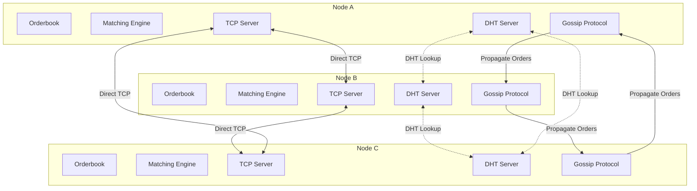
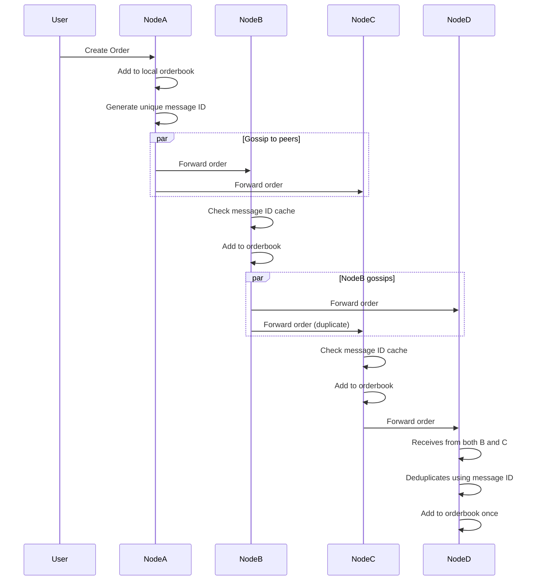
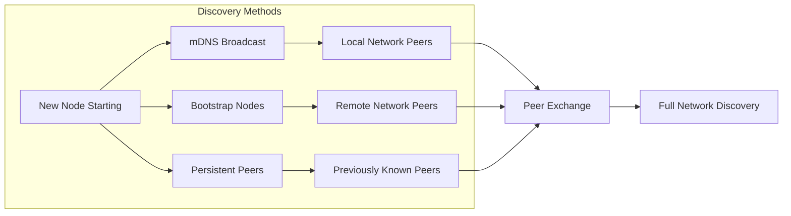
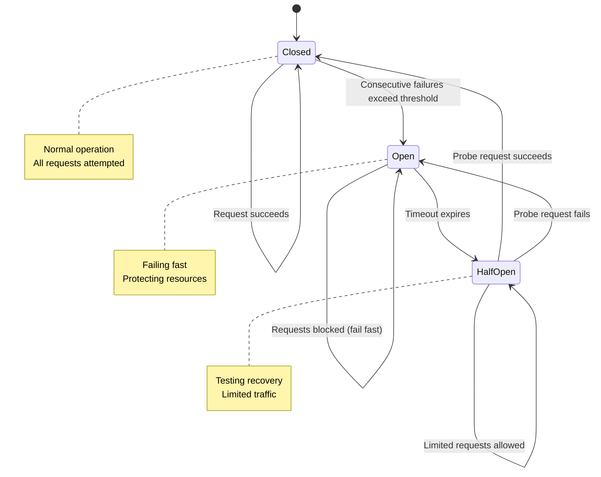
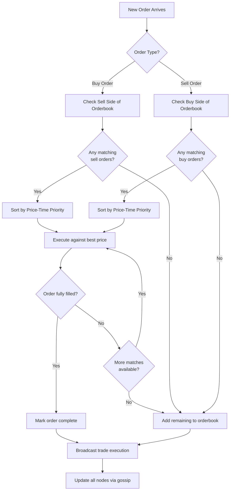
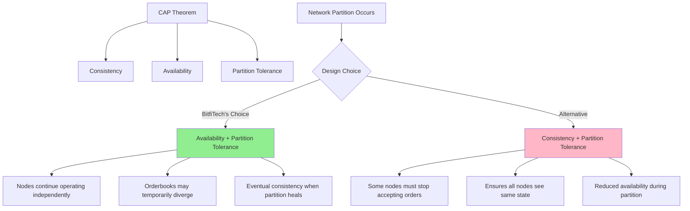

# BitfiTech: A Journey into Peer-to-Peer Exchange Architecture

When I started thinking about decentralized exchanges, I kept running into a conceptual problem. Most systems that call themselves "decentralized" still rely on some form of central coordination. There's always a server somewhere, a database that everyone queries, or an authority that validates transactions. [BitfiTech](https://github.com/RadW2020/bitfitech) emerged from a simple question: what would it actually take to build an exchange where no central server exists at all?

The answer turned out to be more complex and fascinating than I initially imagined. This project became an exploration of distributed hash tables, gossip protocols, vector clocks, and the subtle challenges of maintaining consistency across independent nodes. What follows is a reflection on building a genuinely peer-to-peer trading system.

---

## Understanding the Centralization Problem

Traditional cryptocurrency exchanges operate much like conventional financial institutions. Users connect to a central server that maintains the orderbook, matches trades, and manages user accounts. Even many projects marketed as decentralized exchanges rely on centralized components for critical operations like order matching or price discovery.

This centralization introduces several problems that became clear as I researched existing systems. A central server represents a single point of failure where the entire exchange becomes unavailable if that server goes down. It also creates opportunities for censorship, as operators can arbitrarily block users or transactions. Perhaps more fundamentally, centralization requires users to trust the infrastructure operator, which contradicts the trustless ethos that makes blockchain technology compelling.

I wanted to explore whether we could eliminate these issues entirely by distributing both the orderbook and the matching logic across all participating nodes. This meant each participant would maintain their own copy of the orderbook and independently execute matching algorithms, with orders propagating through the network without passing through any central authority.

---

## Architecture: Distributing Everything

The architecture that emerged centers on several interconnected components, each addressing a specific aspect of the distributed coordination problem.

At the core sits a distributed orderbook where each node maintains its own independent instance. When someone creates an order on one node, that order needs to propagate to every other node in the network. I chose to implement this using a gossip protocol similar to how BitTorrent distributes files. Each node that receives a new order forwards it to its peers, creating a cascade that eventually reaches the entire network. This approach proved surprisingly robust, as there's no single communication path that could fail and prevent order propagation.

For inter-node communication, I integrated Grenache, which provides a distributed hash table based on the Kademlia algorithm. What makes this interesting is that each node runs its own embedded Grenache DHT server. This means there's no external infrastructure to set up or depend on. The DHT becomes a shared abstraction that the nodes collectively maintain, with no single node being essential to its operation.

The nodes also establish direct TCP connections with their peers. When two nodes discover each other, they open a socket connection for direct communication. This creates a mesh topology where information can flow along multiple paths, providing natural fault tolerance. If one connection fails, messages can route through alternative paths.

Peer discovery happens through three complementary mechanisms. On local networks, mDNS broadcasts allow nodes to automatically find each other without any configuration. For connecting to wider networks, the system supports bootstrap nodes, which are well-known entry points that new nodes can contact to join the network. Once connected, nodes exchange information about other peers they know, creating a self-organizing network where nodes help each other discover the broader peer topology.

The complete lifecycle of a node involves several stages. When starting up, the node loads information about previously connected peers from persistent storage and initializes its TCP server. It then begins the discovery process using all available mechanisms simultaneously. As it finds peers, it establishes direct TCP connections. Once connected to the network, it can propagate orders using the gossip protocol. Each node independently performs order matching using vector clocks to maintain consistent event ordering despite the lack of a central clock.

### System Architecture Diagram



This diagram illustrates how each node maintains its own complete instance of the orderbook and matching engine, while communicating with peers through both direct TCP connections and the distributed hash table. The gossip protocol creates redundant paths for order propagation, ensuring reliability even if individual connections fail.

### Order Propagation Flow



This sequence shows how an order created on Node A propagates through the network. The message deduplication mechanism prevents nodes from processing the same order multiple times, even though they might receive it from multiple sources.

### Peer Discovery Mechanisms



The discovery process uses three complementary mechanisms simultaneously. mDNS handles local network discovery automatically, bootstrap nodes provide entry points to wider networks, and persistent peer storage enables quick reconnection to known nodes. Once connected to any peers, the peer exchange mechanism helps discover the broader network topology.

---

## Technical Foundations

The implementation relies on Node.js version 20.19.5 or higher as the runtime environment. Node's asynchronous event-driven architecture maps well to the concurrent nature of peer-to-peer networking, where a node might be simultaneously receiving orders from some peers while forwarding them to others and processing matches locally.

The networking layer builds on standard TCP sockets for peer-to-peer communication, with Grenache providing the distributed hash table abstraction. Using Kademlia as the DHT algorithm was particularly interesting because it has proven reliability in large-scale systems like IPFS and Ethereum's discovery protocol. The algorithm organizes nodes into a structured overlay network that enables efficient lookups with logarithmic complexity.

One of the more challenging aspects turned out to be maintaining consistent event ordering without a central clock. In a distributed system, you can't rely on timestamps because different nodes' clocks may be skewed. I implemented vector clocks to solve this problem. Each event carries a vector representing logical time across all known nodes, allowing any node to independently determine the causal ordering of events. When a node sees two events with vector clocks {node1: 5, node2: 3} and {node1: 4, node2: 7}, it can infer their causal relationship without needing synchronized physical clocks.

### Vector Clock Example

```
Event Timeline Across Three Nodes:

Node A        Node B        Node C
  |             |             |
  | Order1      |             |
  | [A:1,B:0,C:0]            |
  |             |             |
  |------------>| Order1      |
  |             | [A:1,B:1,C:0]
  |             |             |
  |             |------------>| Order1
  |             |             | [A:1,B:1,C:1]
  |             |             |
  |             | Order2      |
  |             | [A:1,B:2,C:1]
  |             |             |
  | Order3      |             |
  | [A:2,B:1,C:0]            |
  |             |             |

Comparing vector clocks:
- Order1 at C [A:1,B:1,C:1] happened after Order1 at B [A:1,B:1,C:0]
- Order2 [A:1,B:2,C:1] and Order3 [A:2,B:1,C:0] are concurrent
  (neither happened before the other)
```

This visualization shows how vector clocks capture causality. When Node A creates Order1, it increments its own counter. When Node B receives and processes Order1, it increments its counter and updates its knowledge of Node A's counter. The vector clock grows as the event propagates, creating a complete causal history. When comparing Order2 and Order3, we can see they're concurrent because neither vector is entirely less than or equal to the other.

For fault tolerance, I incorporated the circuit breaker pattern. When a connection to a peer repeatedly fails, the circuit breaker transitions to an open state where it temporarily stops attempting connections, preventing resource waste on dead peers. After a timeout, it enters a half-open state where it allows probe attempts, and if those succeed, it closes the circuit and resumes normal operation. This creates a self-healing system that adapts to changing network conditions.

### Circuit Breaker State Machine



The circuit breaker prevents cascading failures in the peer network. When a peer becomes unresponsive, the circuit breaker stops wasting resources on connection attempts. After a cooling-off period, it tentatively tries to reconnect. If the peer has recovered, normal operation resumes. If not, the circuit reopens and waits longer before trying again.

The gossip protocol handles information propagation with built-in message deduplication. Each message carries a unique identifier, and nodes maintain a cache of recently seen message IDs. When receiving a message, a node checks if it has already processed that ID. If so, it discards the duplicate. Otherwise, it processes the message and forwards it to its peers. This simple mechanism prevents message storms while ensuring eventual delivery to all nodes.

---

## Operating Modes and Configuration

The system supports three operational modes, each useful for different purposes. The default mode runs Grenache DHT embedded in each node with direct peer-to-peer connections and mDNS local discovery. This represents the complete implementation with no external dependencies.

For testing and development, there's a pure P2P mode that removes the DHT layer entirely, leaving only direct TCP connections. This simplifies debugging by reducing the number of moving parts, though it doesn't meet the full specification since the Grenache DHT was part of the original design requirements.

Finally, there's a legacy mode that connects to external Grenache servers rather than running embedded DHT servers. I kept this mode for backward compatibility, but it introduces centralization through those external servers and isn't recommended for actual use.

Setting up the system requires Node.js and npm with at least 512MB of available RAM. The quick start process involves cloning the repository, installing dependencies with npm, and starting a node. By default, it uses port 3000 for P2P connections, port 20001 for the Grape DHT, and port 30001 for the Grape API.

Testing with multiple nodes is straightforward. Each node can be configured using environment variables to use different ports. I typically run one node with default settings, then start additional nodes with P2P_PORT set to different values like 3001, 3002, and so on. The nodes discover each other through mDNS on the local network and establish connections automatically.

The system exposes considerable configuration through environment variables. You can control networking parameters like the P2P port and host interface. Discovery mechanisms can be individually enabled or disabled, though running all of them simultaneously provides the best resilience. Bootstrap peers can be manually specified as a comma-separated list of host:port combinations, which is useful when connecting across networks where mDNS doesn't work. Connection limits prevent any single node from becoming overwhelmed by too many peer connections.

---

## Implementing Financial-Grade Matching

One aspect that required careful attention was ensuring numerical precision in financial calculations. Floating-point arithmetic introduces rounding errors that are unacceptable when dealing with money. I integrated the Decimal.js library to perform all price and quantity calculations using arbitrary-precision decimal arithmetic. This means a calculation like multiplying price by quantity produces an exact result, not an approximation.

The matching algorithm implements price-time priority, which is standard in professional exchanges. Orders are organized by price, with the best prices having priority. Among orders at the same price level, earlier orders execute first. This requires maintaining temporal ordering information, which connects back to the vector clock implementation discussed earlier.

Partial matching was another interesting challenge. An order for 100 units might match against three separate orders for 30, 40, and 30 units. The algorithm needs to track partially filled orders, update remaining quantities, and ensure the filled portions get properly recorded. The matching engine processes incoming orders against the orderbook, executing whatever portion can be filled and leaving the remainder as a resting order if it's not immediately fully matched.

### Order Matching Process



This flowchart illustrates the matching process. When an order arrives, it first checks the opposite side of the orderbook for potential matches. If matches exist, they're sorted by price-time priority. The engine executes against the best available price, continuing until the order is fully filled or no more matches are available. Any unfilled portion becomes a resting order in the orderbook.

---

## Project Structure and Organization

The codebase organizes into several logical layers. The p2p directory contains everything related to peer-to-peer networking: peer discovery mechanisms, message routing logic, and peer connection management. The core directory houses the orderbook implementation and matching algorithm, which represent the business logic independent of the networking layer.

Utility modules provide cross-cutting concerns like configuration management, logging, and vector clock operations. Separating the vector clock logic into its own module made it easier to test and reason about independently from the rest of the system.

The test suite covers multiple scenarios including peer discovery in various network conditions, order propagation across the network, edge cases in the matching algorithm, fault handling and automatic reconnection, and orderbook synchronization between nodes. Running the tests with coverage reporting helped identify areas that needed additional test cases.

### Project Structure Diagram

```
bitfitech/
│
├── src/
│   ├── p2p/                    # Peer-to-Peer Networking Layer
│   │   ├── discovery/
│   │   │   ├── mdns.js         # Local network discovery
│   │   │   ├── bootstrap.js    # Bootstrap node connections
│   │   │   └── peer-exchange.js # Peer information sharing
│   │   │
│   │   ├── routing/
│   │   │   ├── gossip.js       # Gossip protocol implementation
│   │   │   └── deduplication.js # Message deduplication
│   │   │
│   │   └── peers/
│   │       ├── connection.js   # TCP connection management
│   │       └── persistence.js  # Peer storage
│   │
│   ├── core/                   # Business Logic Layer
│   │   ├── orderbook.js        # Distributed orderbook
│   │   ├── matching.js         # Price-time priority matching
│   │   └── order.js            # Order data structures
│   │
│   ├── services/               # DHT Services (Optional)
│   │   └── grenache/
│   │       ├── embedded.js     # Embedded DHT server
│   │       └── client.js       # DHT client
│   │
│   ├── clients/                # Exchange Interface
│   │   └── exchange-client.js  # User-facing API
│   │
│   └── utils/                  # Cross-Cutting Concerns
│       ├── config.js           # Configuration management
│       ├── logger.js           # Logging system
│       ├── vector-clock.js     # Distributed event ordering
│       └── circuit-breaker.js  # Fault tolerance
│
├── tests/                      # Test Suite
│   ├── unit/
│   ├── integration/
│   └── e2e/
│
└── package.json
```

This structure separates concerns cleanly. The networking layer handles peer communication independently of the business logic. The core layer implements exchange functionality without knowing about network details. Utility modules provide shared functionality that multiple layers use.

---

## Security Considerations and Current Limitations

The current implementation includes basic security measures like peer verification through a handshake protocol, validation of message schemas to reject malformed data, rate limiting to prevent spam attacks, and fault isolation to prevent one misbehaving peer from affecting others.

However, this is fundamentally a permissionless network where any node can join. For a production deployment, several additional security layers would be necessary. All communications should be encrypted using TLS to prevent eavesdropping and man-in-the-middle attacks. Messages should be cryptographically signed so recipients can verify their authenticity. Byzantine fault tolerance mechanisms would protect against actively malicious nodes that try to manipulate the orderbook or matching results. Access control through whitelisting or cryptographic identity verification would prevent unauthorized nodes from joining the network.

I built this primarily as a learning platform for exploring distributed systems concepts, not as production-ready financial infrastructure. The educational value comes from understanding how these components fit together and seeing them operate in a functioning system.

---

## What I Learned About Distributed Systems

Building BitfiTech deepened my understanding of several fundamental distributed systems concepts. The CAP theorem became concrete rather than abstract. In a network partition, you must choose between consistency and availability. BitfiTech chooses availability, allowing nodes to continue operating even when partitioned, accepting that they may temporarily have divergent views of the orderbook.

### CAP Theorem Trade-offs in BitfiTech



This diagram illustrates the fundamental trade-off in distributed systems. BitfiTech prioritizes availability and partition tolerance, allowing the system to continue functioning even when network partitions occur. The trade-off is that nodes might temporarily have different views of the orderbook, which resolve through eventual consistency once the partition heals.

Eventual consistency proved more subtle than I expected. Just because every node eventually receives every order doesn't mean they all see orders in the same sequence. Vector clocks solve the causal ordering problem, but they don't provide total ordering without additional mechanisms. Two concurrent orders with incomparable vector clocks could be processed in different sequences by different nodes.

The gossip protocol's efficiency surprised me. Despite the redundant message passing, it achieves reliable broadcast with relatively low overhead. Each message typically gets forwarded only a few times before deduplication stops further propagation, and the logarithmic scaling means the system could theoretically handle quite large networks.

Testing distributed systems presented unique challenges. Race conditions that never appear in single-threaded code become common. A test might succeed 99 times and fail once due to timing variations. I learned to structure tests to be deterministic by controlling exactly when nodes start and stop, and by using synchronization points to ensure operations complete in a predictable order.

---

## Influences and Intellectual Lineage

BitfiTech stands on the shoulders of several influential distributed systems. BitTorrent demonstrated that gossip protocols could scale to millions of nodes without central coordination. Bitcoin showed how a distributed network could maintain consensus about transaction ordering. The Kademlia DHT, used in IPFS and Ethereum, proved that structured overlays could provide efficient lookups in peer-to-peer networks.

Studying Raft and Paxos consensus algorithms informed my thinking about consistency even though BitfiTech doesn't implement full consensus. Understanding how those algorithms guarantee agreement helped clarify what guarantees BitfiTech does and doesn't provide.

---

## Current Limitations and Future Directions

The implementation currently functions as an educational simulator rather than handling real assets. Scaling beyond about 100 nodes hasn't been tested, and I expect the gossip protocol latency would increase significantly with network size. Geographic distribution would introduce additional latency challenges that the current architecture doesn't address.

Several directions could extend this work. Adding TLS encryption would be straightforward and important for any real deployment. A reputation system where nodes track peer behavior could help identify and isolate misbehaving nodes. Optimizing propagation for large networks might involve hierarchical gossip or more sophisticated routing. Integrating with actual blockchains would make it possible to settle real trades, transforming this from a simulator into a functional exchange. Building a web dashboard for visualization would help understand network topology and order flow.

---

## Reflections on Decentralization

Working on this project clarified what "decentralization" actually means in practice. It's not just about using blockchain or distributing some components. True decentralization means there's no node whose failure breaks the system, no authority that can censor transactions, and no component that users must trust.

Achieving this required distributing not just data but also logic. Every node runs the matching algorithm independently. Every node maintains the complete orderbook. Every node participates in propagating orders. This redundancy comes at a cost in terms of network bandwidth and computation, but it's necessary to eliminate central points of control.

The transparency that comes with decentralization was also valuable. Because every node has complete information and all communication is peer-to-peer, anyone can audit the system's behavior. There's no black box where things happen invisibly. This creates accountability through architecture rather than through trust in operators.

---

## Practical Applications

Beyond its use as an exchange, BitfiTech serves as a platform for studying distributed systems concepts. The codebase provides concrete examples of DHT implementation, gossip protocol design, vector clock usage, and circuit breaker patterns. Someone learning about these topics can see them working together in an integrated system rather than as isolated abstractions.

For research into distributed exchange designs or DeFi architecture, this provides a foundation that could be extended in various directions. The core peer-to-peer infrastructure could support different matching algorithms, alternative consensus mechanisms, or integration with different blockchain settlement layers.

---

## Getting Started

The repository includes complete setup instructions. After cloning and installing dependencies, starting a node takes a single command. The default configuration enables all discovery mechanisms, so nodes on the same local network will find each other automatically.

For connecting across networks, setting the BOOTSTRAP_PEERS environment variable to point to a known node provides an entry point to the network. Once connected to one peer, peer exchange will gradually connect you to others.

The logging system provides visibility into what's happening. Setting LOG_LEVEL to debug shows detailed information about peer discovery, message routing, and order matching, which is helpful for understanding the system's operation or troubleshooting issues.

---

## Closing Thoughts

BitfiTech represents an exploration of what genuine decentralization requires in a trading system. It demonstrates that eliminating central servers is possible, though it introduces new challenges around consistency, ordering, and fault tolerance.

The project taught me that distributed systems require thinking differently about familiar problems. Without a central database, you need gossip protocols. Without a central clock, you need vector clocks. Without a central authority, you need cryptographic verification. Each removed point of centralization necessitates new mechanisms to replace the coordination that centralization provided.

The code is open source and designed to be approachable for anyone interested in exploring these concepts. Whether you're studying distributed systems, investigating decentralized exchange designs, or just curious about peer-to-peer networking, I hope this project provides useful insights.

---

## Resources

The complete source code and documentation are available at [https://github.com/RadW2020/bitfitech](https://github.com/RadW2020/bitfitech). The README includes setup instructions, architecture details, and troubleshooting guidance.

For deeper understanding of the underlying technologies, the Grenache framework documentation at [https://github.com/bitfinexcom/grenache](https://github.com/bitfinexcom/grenache) explains the DHT implementation. Academic papers on vector clocks, gossip protocols, and the Kademlia DHT provide theoretical foundations for the practical implementations in this project.

---

*November 2025*
